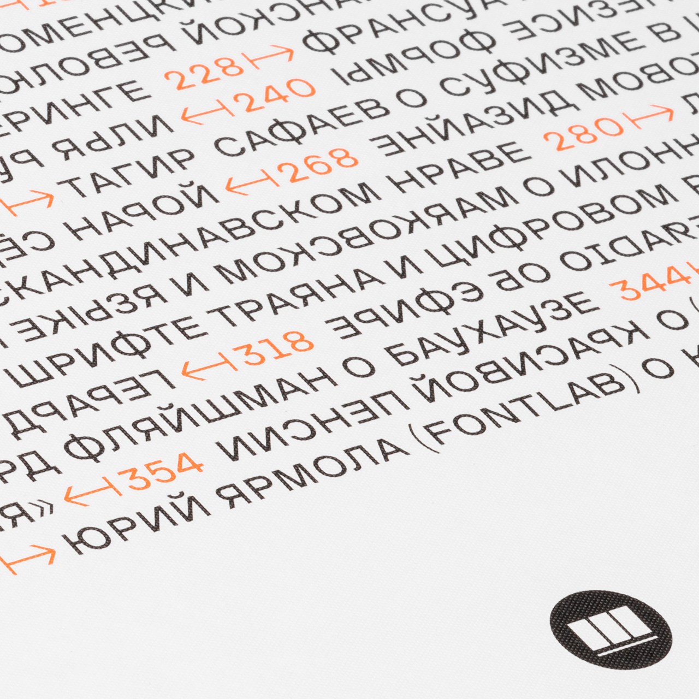
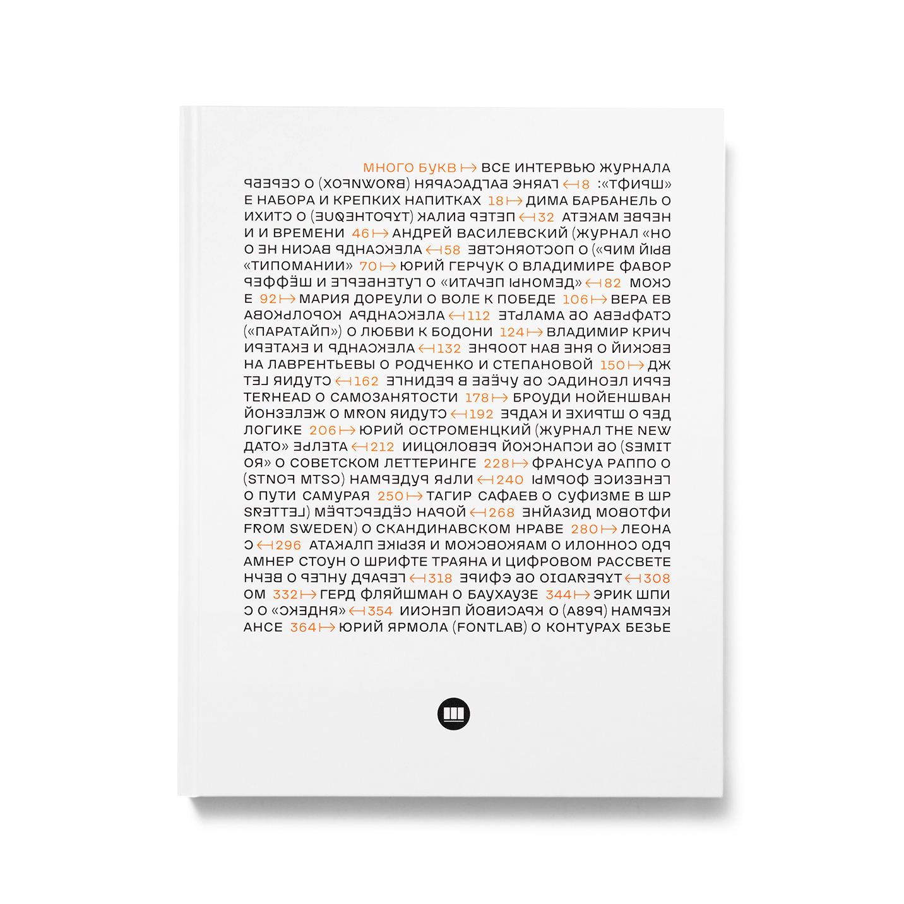

# Adaptive boustrophedon typesetter

This small script was inspired by Gerard Unger's reflections on the nature of reading and was specifically created for the cover of the book "Много букв" ("Many Letters" in English). The key idea is the interaction of reversed Boustrophedon letters and some Cyrillic letters that already appear reversed, and therefore, do not need to be flipped since they "look" in the opposite direction of the line.

# Instructions

To change the text, style and flipping parameters, you need to edit the editor.txt file.

The script requires Python 3.7 or higher version to run, as well as Drawbot as a library.

# The book

"Много букв" contains all the interviews conducted by the Shrift magazine and was printed and made available for purchase at the [store](https://bit.ly/mnogobukv).

